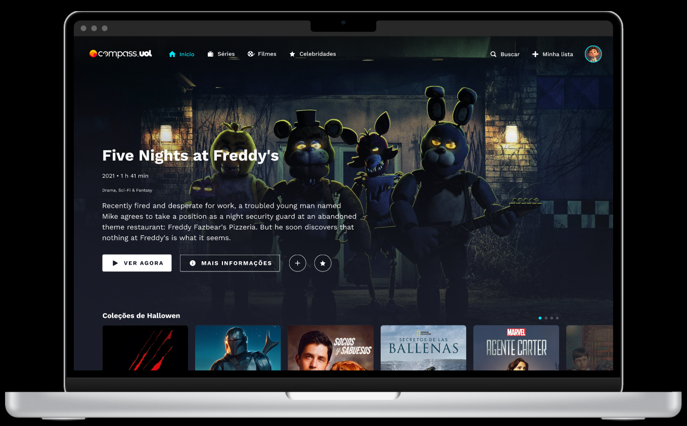

<div>
    <h1>Challenge 2 - Compass Video</h1>
    
</div>

<h1>Challenge Description:</h1>
<h4>You’ll need to recreate the page mentioned above, a fictional streaming site, with information about movies, series and actors, staying loyal to its original design using React.</h4>


<h1>The MANDATORY requirements are:</h1>

- Use the [TMDB](https://developer.themoviedb.org/reference/intro/getting-started) api to handle user authentication and request calls to get movies/tv shows/artists information. The documentation provides all the information you’ll need to apply this functionality;
- TypeScript with React (tsx files);
- [React Router](https://reactrouter.com/en/main) to create the routing (when not using Next.js);
- When clicking on a movie card, you need to redirect the user to the specific route that contains its detailed information.
- Create sliders to display the movies. Library recomendation: [Splide](https://splidejs.com/). [Splide for React docs.](https://splidejs.com/integration/react-splide/) **Feel free to use wichever library you prefer.**
- To render the movies, you need to do a GET request to the [TMDB](https://developer.themoviedb.org/reference/intro/getting-started) api;
- Create a private repo in your Github and add your teammates and instructors to the project.
- Make small commits and use Conventional Commits to keep your repository organized.

<h1>The OPTIONAL requirements are:</h1>
- Responsive screens (We recommend to start with Mobile First);
- Use Next.js instead of React
- Add a README to your project.
- Use ReactQuery to manage request calls (you can make cache calls to save data from endpoints for some time)
- Unit Tests/E2E tests

This is a [Next.js](https://nextjs.org/) project bootstrapped with [`create-next-app`](https://github.com/vercel/next.js/tree/canary/packages/create-next-app).

## Getting Started

First, run the development server:

```bash
npm run dev
# or
yarn dev
# or
pnpm dev
# or
bun dev
```

Open [http://localhost:3000](http://localhost:3000) with your browser to see the result.

You can start editing the page by modifying `app/page.tsx`. The page auto-updates as you edit the file.

This project uses [`next/font`](https://nextjs.org/docs/basic-features/font-optimization) to automatically optimize and load Inter, a custom Google Font.

## Learn More

To learn more about Next.js, take a look at the following resources:

- [Next.js Documentation](https://nextjs.org/docs) - learn about Next.js features and API.
- [Learn Next.js](https://nextjs.org/learn) - an interactive Next.js tutorial.

You can check out [the Next.js GitHub repository](https://github.com/vercel/next.js/) - your feedback and contributions are welcome!

## Deploy on Vercel

The easiest way to deploy your Next.js app is to use the [Vercel Platform](https://vercel.com/new?utm_medium=default-template&filter=next.js&utm_source=create-next-app&utm_campaign=create-next-app-readme) from the creators of Next.js.

Check out our [Next.js deployment documentation](https://nextjs.org/docs/deployment) for more details.
